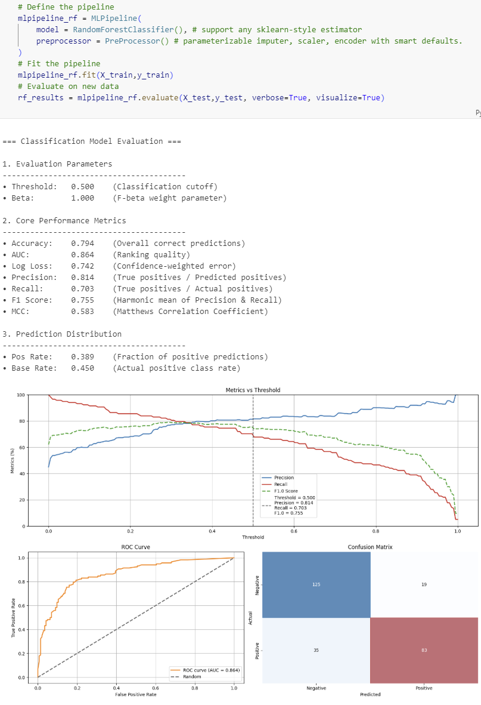
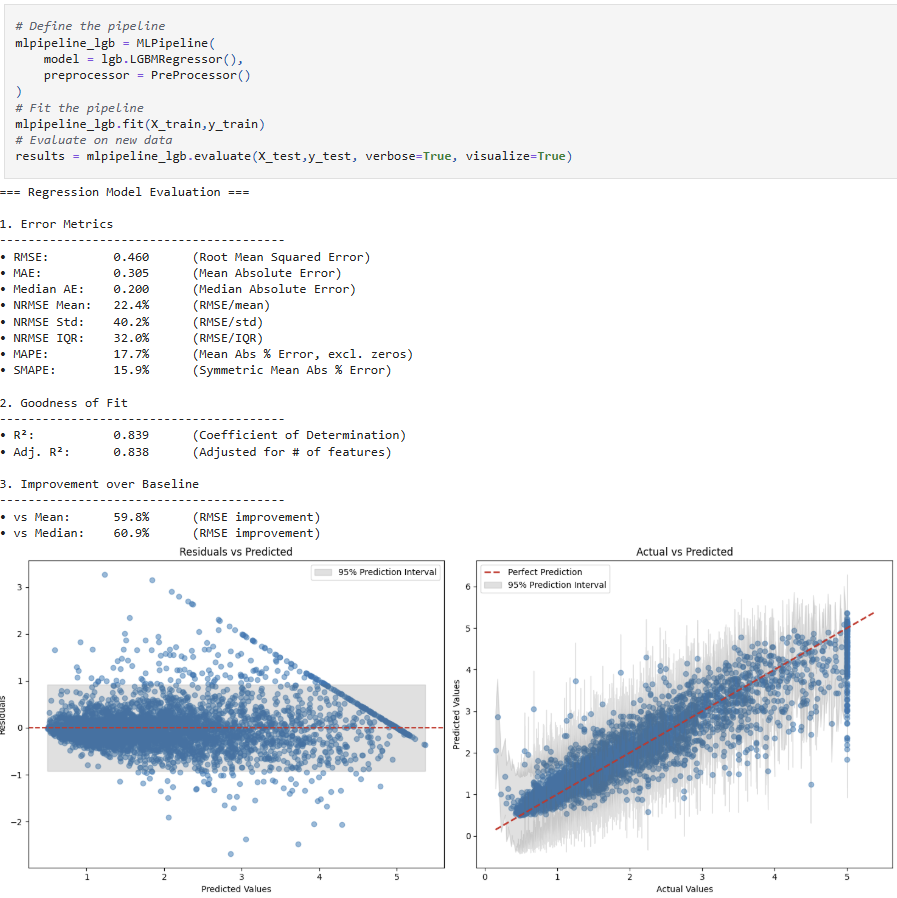
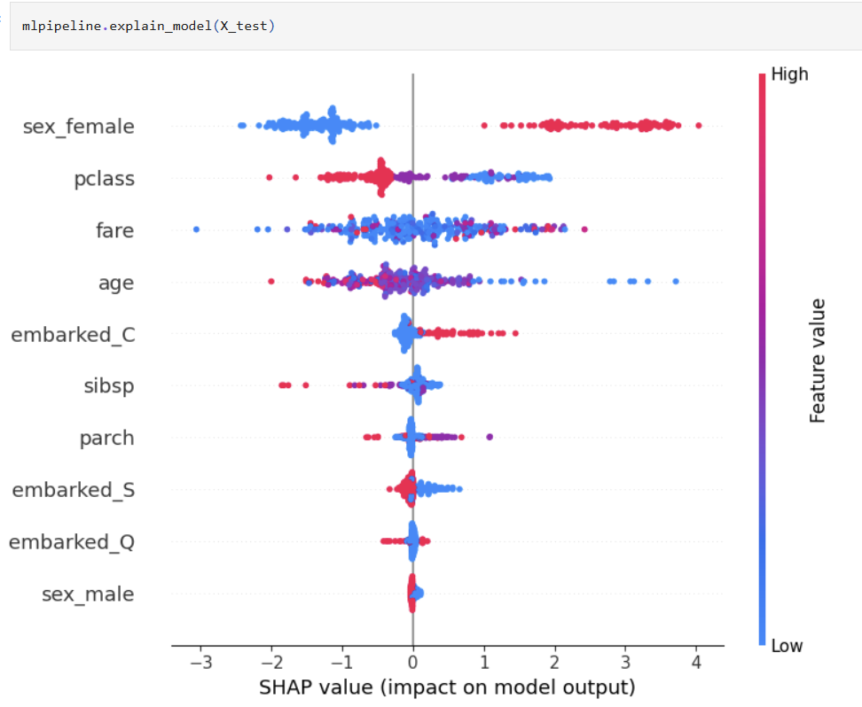
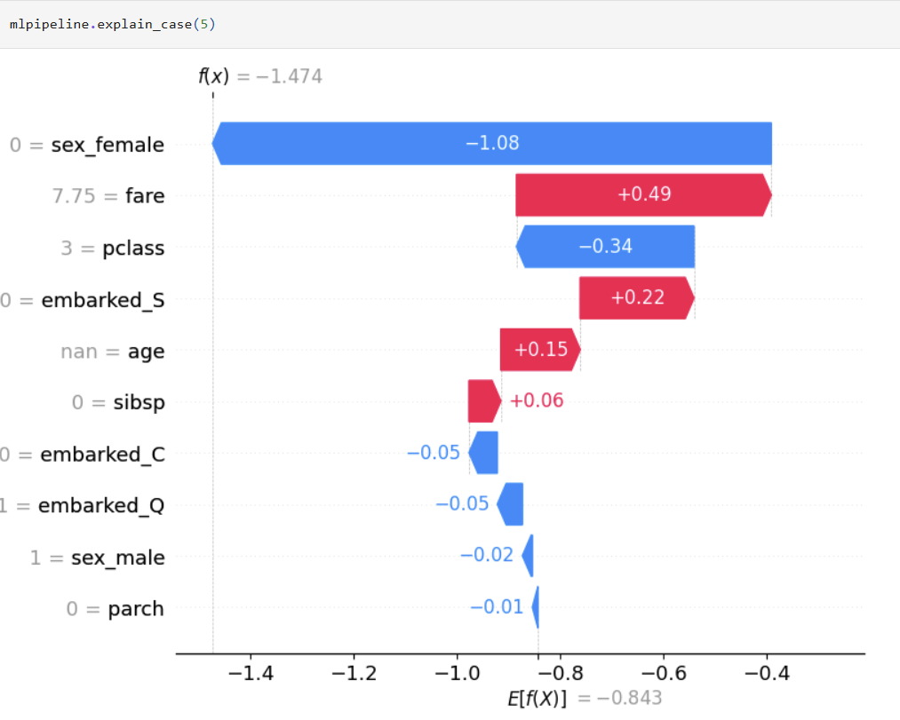
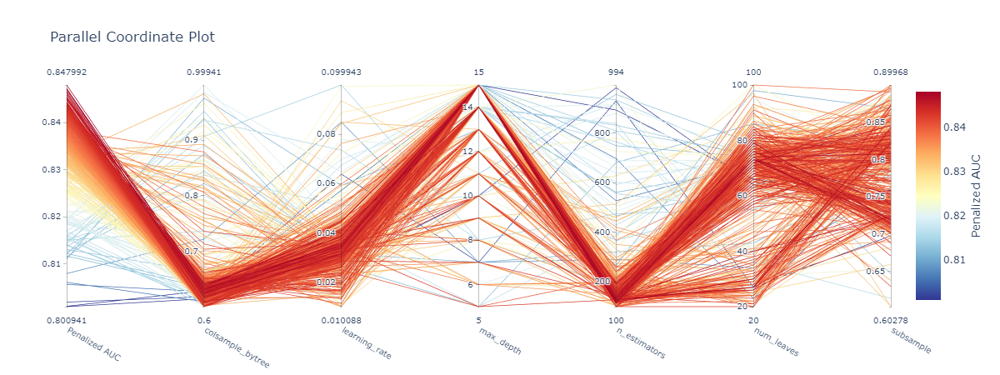

# MLArena

[](https://www.python.org/downloads/)
[](https://pypi.org/project/mlarena/)
[](https://opensource.org/licenses/MIT)
[](https://github.com/psf/black)
[](https://pycqa.github.io/isort/)
[](https://github.com/MenaWANG/mlarena/actions/workflows/mlarena.yml)

An algorithm-agnostic machine learning toolkit for model training, diagnostics and optimization.

## Publications

Read about the concepts and methodologies behind MLArena through these articles:

1. [Algorithm-Agnostic Model Building with MLflow](https://medium.com/data-science/algorithm-agnostic-model-building-with-mlflow-b106a5a29535) - Published in Towards Data Science
   > A foundational guide demonstrating how to build algorithm-agnostic ML pipelines using mlflow.pyfunc. The article explores creating generic model wrappers, encapsulating preprocessing logic, and leveraging MLflow's unified model representation for seamless algorithm transitions.

2. [Explainable Generic ML Pipeline with MLflow](https://medium.com/data-science/explainable-generic-ml-pipeline-with-mlflow-2494ca1b3f96) - Published in Towards Data Science
   > An advanced implementation guide that extends the generic ML pipeline with more sophisticated preprocessing and SHAP-based model explanations. The article demonstrates how to build a production-ready pipeline that supports both classification and regression tasks, handles feature preprocessing, and provides interpretable model insights while maintaining algorithm agnosticism.

## Installation

The package is undergoing rapid development at the moment (pls see [CHANGELOG](https://github.com/MenaWANG/mlarena/blob/master/CHANGELOG.md) for details), it is therefore highly recommended to install with specific versions. For example

```bash
%pip install mlarena==0.2.0
```

If you are using the package in [Databricks ML Cluster with DBR runtime >= 16.0](https://learn.microsoft.com/en-us/azure/databricks/release-notes/runtime/16.0ml), you can install without dependencies like below:

```bash
%pip install mlarena==0.2.0 --no-deps
```
If you are using earlier DBR runtimes, simply install `optuna` in addition. Note: As of 2025-04-26, `optuna` is recommended by Databricks, while `hyperopt` will be [removed from Databricks ML Runtime](https://docs.databricks.com/aws/en/machine-learning/automl-hyperparam-tuning/).

```bash
%pip install mlarena==0.2.0 --no-deps
%pip install optuna>=3.6.1
```

## Usage Example

* For quick start with a basic example, see [1.basic_usage.ipynb](https://github.com/MenaWANG/mlarena/blob/master/examples/1.basic_usage.ipynb).   
* For more advanced examples on model optimization, see [2.advanced_usage.ipynb](https://github.com/MenaWANG/mlarena/blob/master/examples/2.advanced_usage.ipynb).   
* For visualization utilities, see [3.utils_plot.ipynb](https://github.com/MenaWANG/mlarena/blob/master/examples/3.utils_plot.ipynb).
* For handling common challenges in machine learning, see [4.ml_discussions.ipynb](https://github.com/MenaWANG/mlarena/blob/master/examples/4.ml_discussions.ipynb).

## Visual Examples:

### Model Performance Analysis

    

    

### Explainable ML
One liner to create global and local explanation based on SHAP that will work across various classification and regression algorithms.     

    

    

### Hyperparameter Optimization
Parallel coordinates plot for hyperparameter search space diagnostics.    



## Features

**Algorithm Agnostic ML Pipeline**
- Unified interface for any scikit-learn compatible model
- Consistent workflow across classification and regression tasks
- Automated report generation with comprehensive metrics and visuals
- Production-ready with MLflow integration for deployment
- Simplified handoff between experimentation and production

**Intelligent Preprocessing**
- Streamlined feature preprocessing with smart defaults and minimal code
- Automatic feature analysis with data-driven encoding recommendations 
- Integrated target encoding with visualization for optimal smoothing selection
- Feature filtering based on information theory metrics (mutual information)
- Handles the full preprocessing pipeline from missing values to feature encoding
- Seamless integration with scikit-learn and MLflow for production deployment


**Model Optimization**
- Efficient hyperparameter tuning with Optuna's TPE sampler
- Smart early stopping with patient pruning to save computation resources
- Cross-validation with variance penalty to prevent overfitting
- Parallel coordinates visualization for search history tracking and parameter space diagnostics
- Automated threshold optimization with business-focused F-beta scoring

**Performance Analysis**
- Comprehensive metric tracking
  - Classification: AUC, F1, Fbeta, precision, recall
  - Regression: RMSE, MAE, R2, adjusted R2, MAPE 
- Performance visualization
  - Classification: ROC_AUC curve, Precision-recall curve
  - Regression: Residual analysis, Prediction error plot  
- Model interpretability
  - Global feature importance
  - Local prediction explanations


## Contributing

Contributions are welcome! Please feel free to submit a Pull Request.

## License

This project is licensed under the MIT License - see the LICENSE file for details. 
