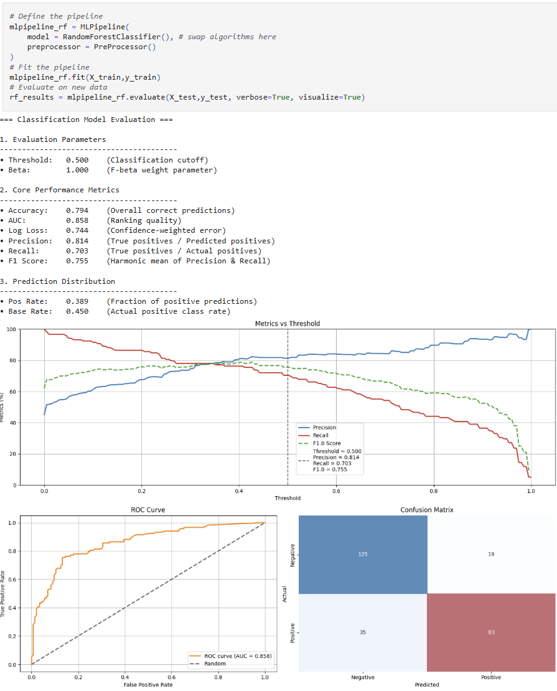
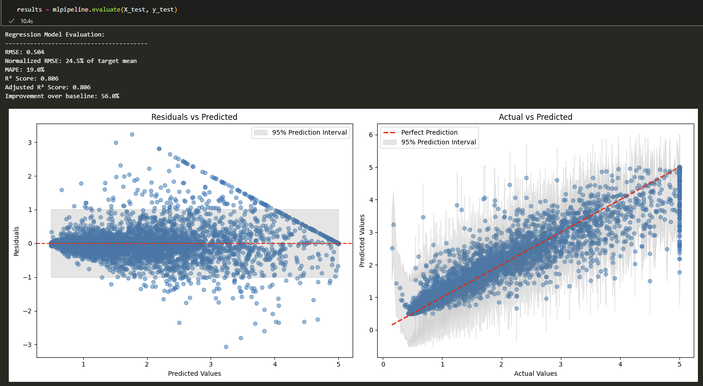

# Example notebooks

The repository includes worked notebooks with code, discussion, and visual
outputs. Download or clone the repository to run them locally; the links below
open their GitHub previews. Some advanced examples need optional dependencies
or environment-specific configuration.

| Topic | Notebook |
| --- | --- |
| Training and evaluation | [Basic usage](https://github.com/MenaWANG/mlarena/blob/master/examples/1.basic_usage.ipynb) |
| Tuning and optimization | [Advanced usage](https://github.com/MenaWANG/mlarena/blob/master/examples/2.advanced_usage.ipynb) |
| Charts and visual analysis | [Plot utilities](https://github.com/MenaWANG/mlarena/blob/master/examples/3.utils_plot.ipynb) |
| Data cleaning | [Data utilities](https://github.com/MenaWANG/mlarena/blob/master/examples/3.utils_data.ipynb) |
| Statistical analysis | [Statistics utilities](https://github.com/MenaWANG/mlarena/blob/master/examples/3.utils_stats.ipynb) |
| Input and output | [I/O utilities](https://github.com/MenaWANG/mlarena/blob/master/examples/3.utils_io.ipynb) |
| Modeling decisions | [ML discussions](https://github.com/MenaWANG/mlarena/blob/master/examples/4.ml_discussions.ipynb) |

## Evaluation preview

